# Rats without Hats
### Contributors:
* [Justin Cropsey](https://github.com/jcropsey-gatech)
* [David Gordon](https://github.com/DavidCGordon)
* [Su Timurturkan](https://github.com/sutimurturkan)

### Summary Figure
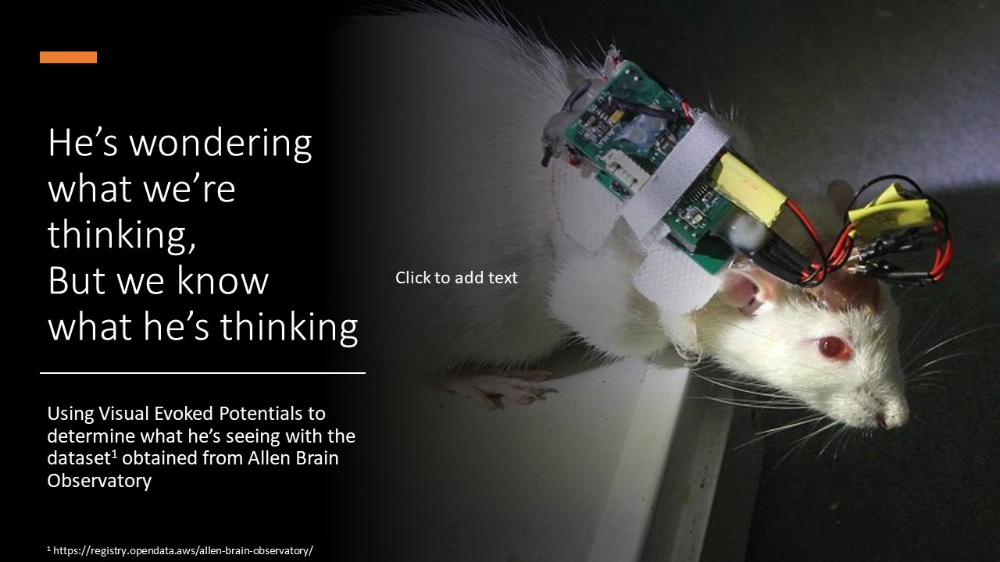

### Introduction
Due to loss of team members and the complexity of the Allen Brain Observatory's data, we switched to Sohel Rana's [Parkinson's Disease Classification](https://www.kaggle.com/sohelranaccselab/parkinsons-disease-classification) (PDC) dataset on Kaggle.

[Parkinson's Disease](https://www.mayoclinic.org/diseases-conditions/parkinsons-disease/symptoms-causes/syc-20376055) (PD) is a progressive neurodegenerative disorder that is part of the Lewy Body Dementias umbrella that also includes [Dementia with Lewy Bodies](https://www.mayoclinic.org/diseases-conditions/lewy-body-dementia/symptoms-causes/syc-20352025) (DLB). As the name of the umbrella term implies, the defining characteristic of both disorders is the presence of Lewy bodies (plaques in the brain). While both disorders ultimately result in the same symptoms, the distinguisher between them is whether the tremor (PD) or another symptom appears first.

Like other diseases that plaques in the brain (e.g., Alzheimer's disease), biopsy is off limits due to the dangers associated with neurosurgery. While a form of single-photon emission computerized tomography (SPECT) scan called a dopamine-transporter scan (DaTscan) can assist in diagnosis, it is expensive. Our goal is to elaborate a minimally invasive, low-cost solution using speech characteristics and machine learning to aid in diagnosis of PD.

For our project, we will apply the unstructured learning techniques taught in this class to analyze over 750 dimensions of speech characteristics. Afterwards, we will apply structured learning techniques to the annotated datasets to be able to predict whether a patient exhibiting certain patterns of speech characteristics merits further evaluation for PD.

### Methods
The PDC dataset contains 754 different dimensions of data measuring various speech pathologies along with binary gender categorization. Each patient was sampled three times. There are 64 unaffected individuals and 188 affected individuals represented in the data set (756 samples total). No missing data points were observed in the data set. Following import, the data was split apart into various blocks (viz., headers, patient IDs, and X-Y data). The X-Y data (not including the disease classification (Y)) was scaled using Scikit-Learn's [StandardScaler](https://scikit-learn.org/stable/modules/generated/sklearn.preprocessing.StandardScaler.html).

    scaler = StandardScaler()
	scaler.fit(xDataFrame)
	xNumPy = scaler.transform(xDataFrame);

The X-Y data set was sorted based on disease classification (Y) and split into unaffected vs affected sets at the boundary. The two sets were subsequently individually split by a common ratio into training vs testing sets, yielding unaffected-training, unaffected-testing, affected-training, and affected-testing set, while ensuring that all samples of a particular patient went into either their respective training or testing set but not both.

A k-means elbow analysis in the range of k = \[4,40\] was performed on the entire data set using Yellowbrick's [K-Elbow Visualizer](https://www.scikit-yb.org/en/latest/api/cluster/elbow.html). Higher orders were examined in narrower ranges due to the increased processing time associated with higher orders.
	model = KMeans();
	visualizer = KElbowVisualizer(model, k=(2,40));

	visualizer.fit(xDataFrame)        # Fit the data to the visualizer
	visualizer.show()

A direct k-means analysis with k = 2 (from the elbow method) was performed on the scaled X data set. The number of representatives in each cluster were tabulated to determine which cluster represented which disease status.

A [Principal Component Analysis](https://scikit-learn.org/stable/modules/generated/sklearn.decomposition.PCA.html) (PCA) was performed with Scikit-Learn's PCA() over the entire X data set. n was chosen to be 170 because that represented 95.1% of the variance observed in the data. Another k-means elbow analysis in the range of k = \[2, 40\] was performed on the PCA transformed data. Again k was chosen to be 2, and a k-means analysis performed.

Under the assumption that PD is a collection of diseases due to heterogeneity in the rates of degeneration across the various neuroanatomical regions in patients, the PCA and subsequent k-means analysis was performed again, but with the PCA only fitted over the unaffected or the affected subsets of X. (Transformation was performed across the entire data set.) The goal was to identify a well-defined cluster of one of the disease states and then define the other states as everything else (i.e., universe - cluster). Due to the high explained-variance ratio when fitting PCA to unaffected data alone, an additional k = 6 k-means analysis was performed.

A 2-component [Gaussian Mixture Model](https://scikit-learn.org/stable/modules/generated/sklearn.mixture.GaussianMixture.html) (GMM) was iteratively run over the raw data set and the n=170 holistically-fitted PCA data set with [confusion matrices](https://scikit-learn.org/stable/modules/generated/sklearn.metrics.confusion_matrix.html) rendered with the goal being to identify matrices where one of the diagonals is much larger than the other.

Ten-bin [histograms](https://matplotlib.org/stable/api/_as_gen/matplotlib.pyplot.hist.html) were prepared on a 5-component PCA analysis fitted to the full, unaffected, and affected data sets, respectively.

### Results
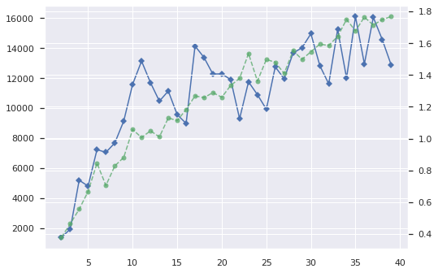
39.0, 322.0 = 0.8919667590027701
153.0, 242.0 = 0.6126582278481013

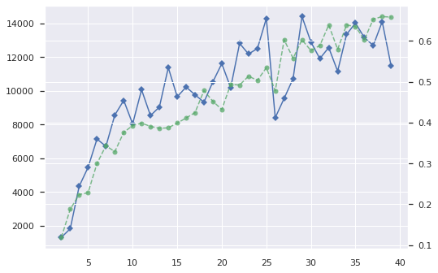
38.0, 320.0 = 0.8938547486033519
154.0, 244.0 = 0.6130653266331658

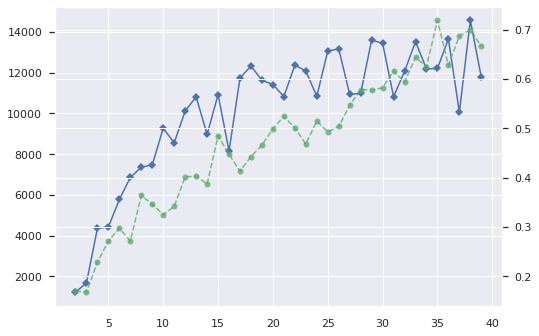
156.0, 247.0 = 0.6129032258064516
36.0, 317.0 = 0.8980169971671388

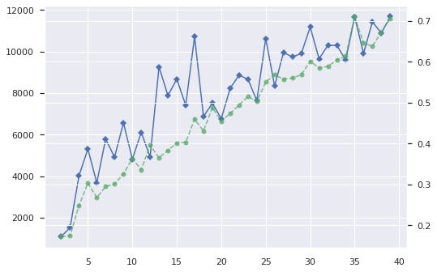
Explained variance 0.998356151725937
44.0, 337.0 = 0.884514435695538
148.0, 227.0 = 0.6053333333333333

170-component PCA fit to Healthy Data, k=6 k-Means Analysis
78.0, 42.0 = 0.35
58.0, 159.0 = 0.7327188940092166
10.0, 162.0 = 0.9418604651162791
19.0, 106.0 = 0.848
22.0, 87.0 = 0.7981651376146789
5.0, 8.0 = 0.6153846153846154

2-component GMM raw X data
[[191   1]
 [561   3]]
[[151  41]
 [227 337]]
[[169  23]
 [276 288]]
[[157  35]
 [257 307]]
[[167  25]
 [274 290]]
[[156  36]
 [247 317]]
[[ 41 151]
 [337 227]]
[[168  24]
 [280 284]]
[[  2 190]
 [  3 561]]
[[151  41]
 [227 337]]
 
2-component GMM PCA-170-whole X data
[[187   5]
 [546  18]]
[[ 97  95]
 [289 275]]
[[ 95  97]
 [275 289]]
[[187   5]
 [546  18]]
[[ 97  95]
 [287 277]]
[[  3 189]
 [ 17 547]]
[[ 97  95]
 [289 275]]
[[ 97  95]
 [287 277]]
[[ 87 105]
 [270 294]]
[[ 98  94]
 [277 287]]
 
Five-Component PCA Fitted to Full Data Set
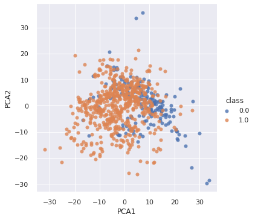
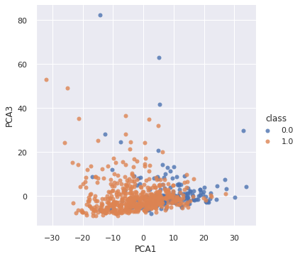
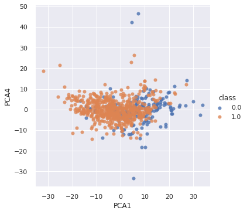
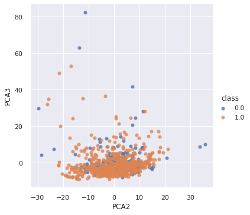
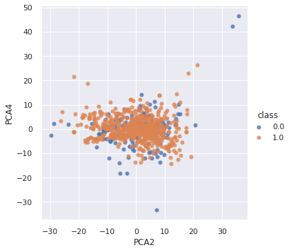
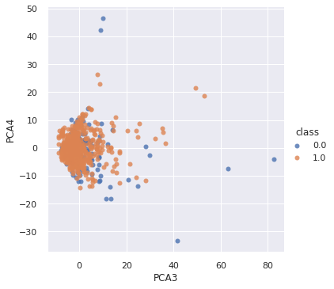

Five-Component PCA Fitted to Unaffected Data Set
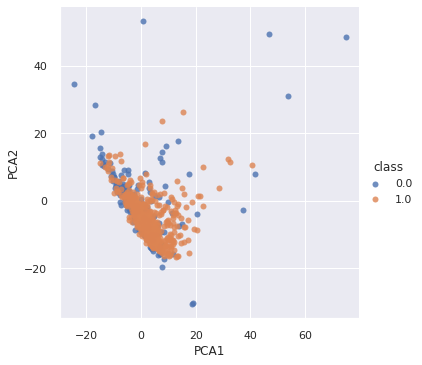
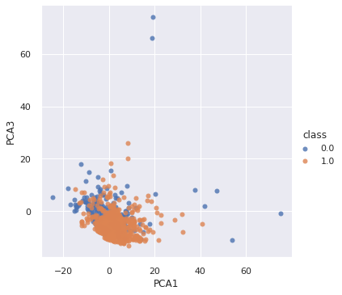
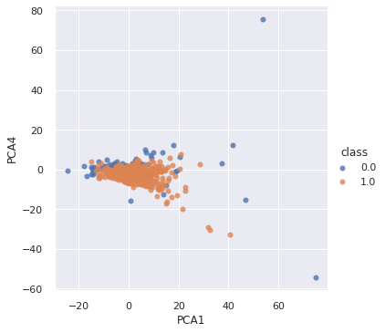
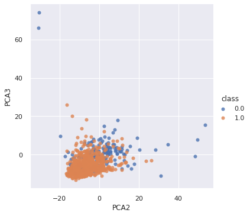
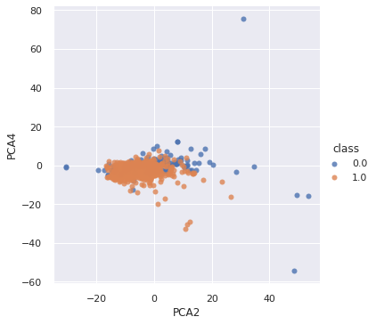
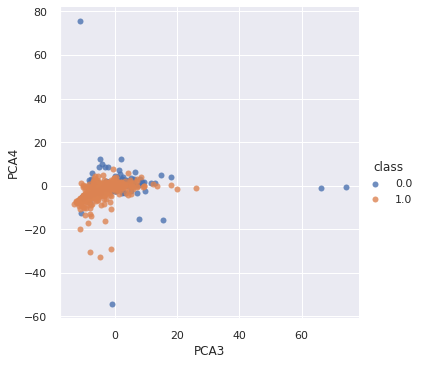

Five-Component PCA Fitted to Affected Data Set
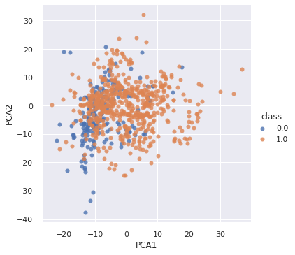
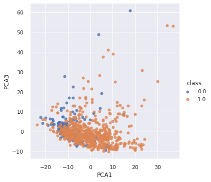
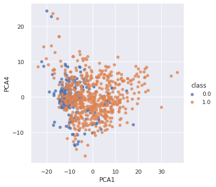
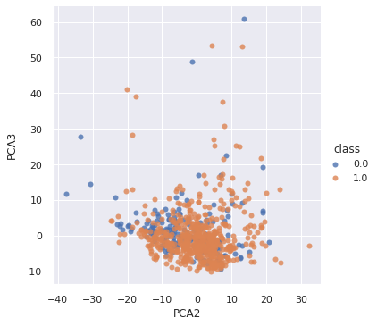
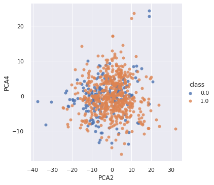
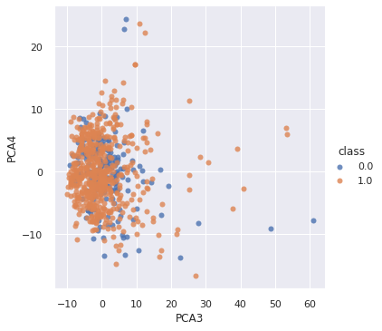

Ten-Bin Histogram of 5-Component PCA Fitted to Full Data Set
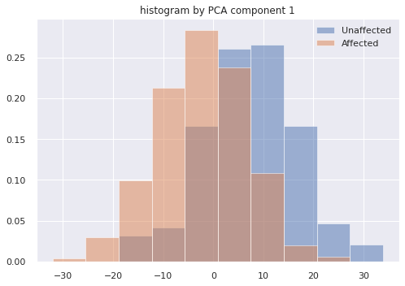
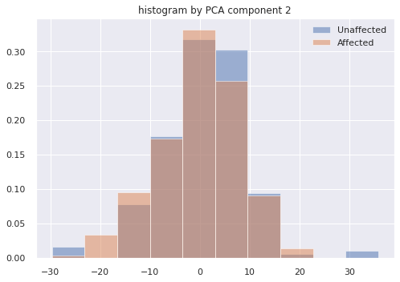
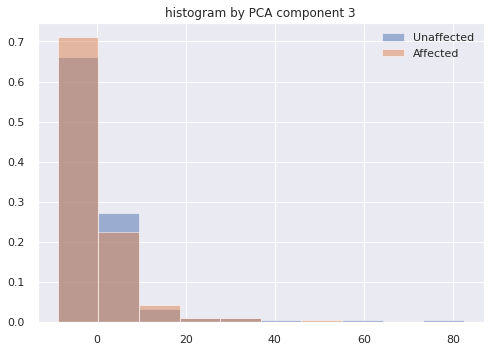
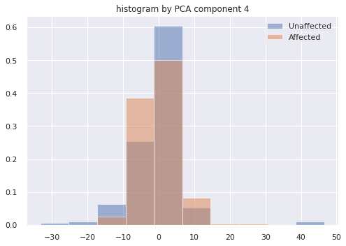
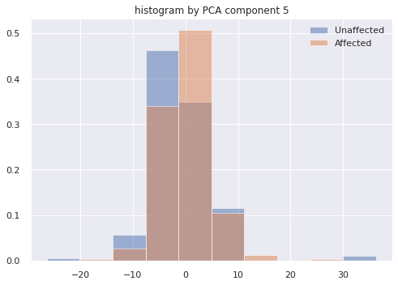

Ten-Bin Histogram of 5-Component PCA Fitted to Unaffected Data Set
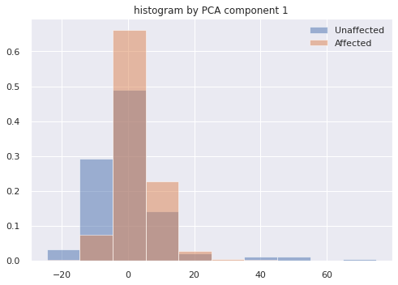
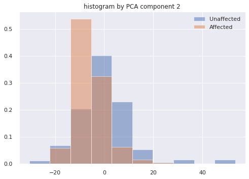
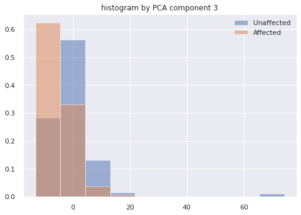
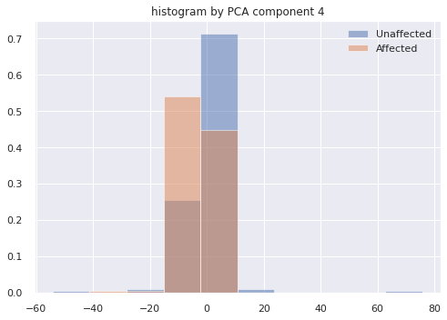
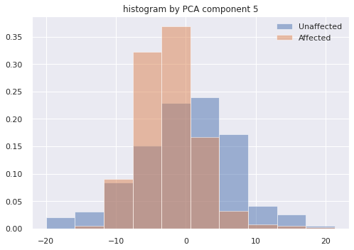

Ten-Bin Histogram of 5-Component PCA Fitted to Affected Data Set
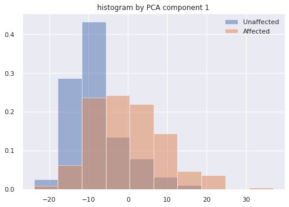
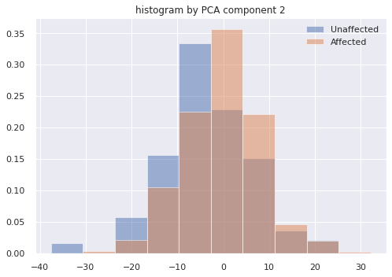
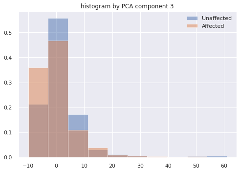
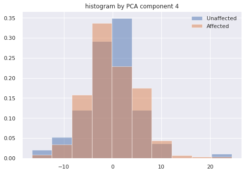
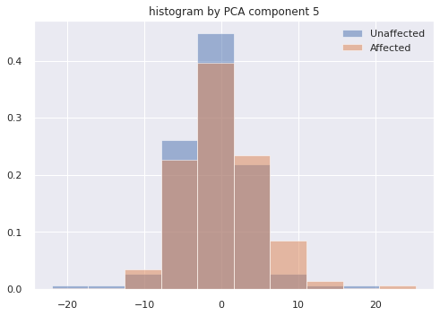

Our experiment will have four parts to its results. The first and second, our mid-term "exams" for success, are whether the data is clusterable and whether the clustering is generalizable between participants. The third and fourth parts extend these to determine whether visual stimuli can be predicted from brain readings and whether this is generalizable among participants. Success is defined as correctly predicting the visual stimulus with a probability greater than chance alone.

### Discussion
Although a brain reading model raises many ethical questions, it also has great potential in furthering healthcare technology, particularly for people suffering from neurodenerative(e.g., Lou Gehrig's disease) or neuro-muscular (e.g., myasthenia gravis) disorders where the brain itself remains intact, but the suffer's ability to interact with the outside world is significantly impaired. This technology could be extended to provide them a means to communicate with the outside world after their motor abilities are lost.

### References
[Allen Brain Map](https://portal.brain-map.org/explore/circuits/visual-coding-neuropixels)

[Machine learning for neural decoding](https://arxiv.org/ftp/arxiv/papers/1708/1708.00909.pdf)

[Real-Time Decoding of Nonstationary Neural Activity in Motor Cortex](https://ieeexplore.ieee.org/document/4483654)

[Frank Rosenblatt: Principles of Neurodynamics: Perceptrons and the Theory of Brain Mechanisms](https://link.springer.com/chapter/10.1007/978-3-642-70911-1_20)